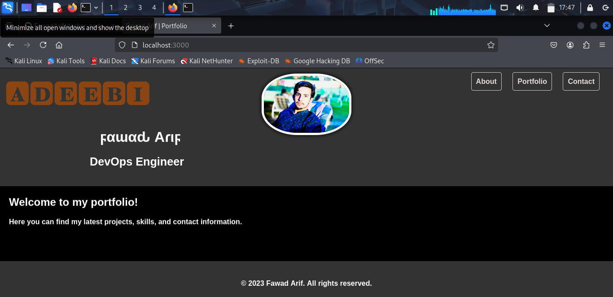
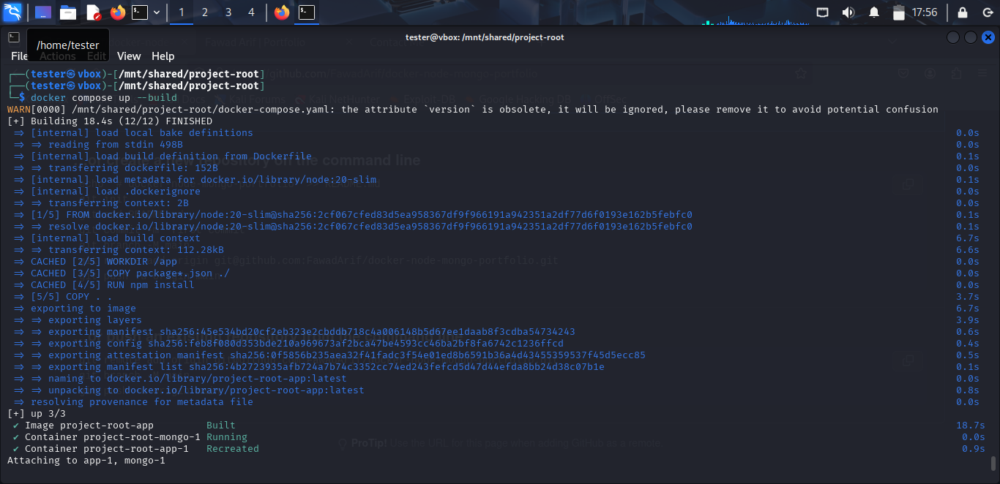
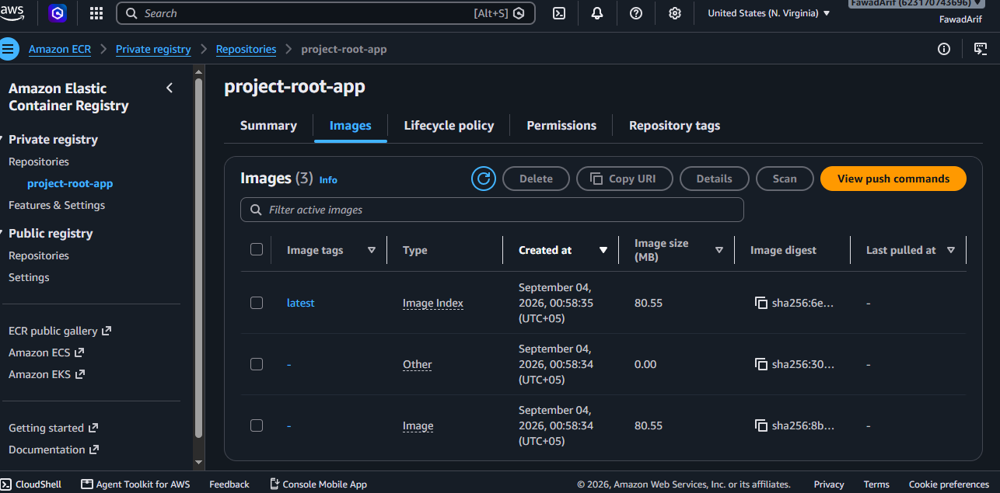

# Full-Stack Portfolio App - Dockerized with Node.js, Express & MongoDB

A containerized full-stack web application featuring  custom portfolio site backed by a Node.js/Express server and a MongoDB database, orchestrated with Docker Compose and published to AWS Elastic Container Registry (ECR).

---

## Overview

This project demonstrates a complete DevOps workflow — from writing application code, to containerizing it, to publishing it on a cloud container registry:

- A static portfolio frontend (HTML/CSS) served via Express
- A backend REST endpoint that accepts contact-form submissions
- Persistent storage of form data in MongoDB
- Multi-container orchestration using Docker Compose
- Custom Docker image built and pushed to AWS ECR

---

## Architecture

Browser (HTML/CSS) --> HTTP request --> Express App (server.js) --> Query --> MongoDB Container

All services run inside a Docker network created by Docker Compose.

---

## Tech Stack
```
    Layer         ~   Technology
Frontend          | HTML, CSS
Backend           |  Node.js, Express
Database          |  MongoDB, Mongoose
Containerization  |  Docker, Docker Compose
Cloud Registry    |  AWS Elastic Container Registry
Dev Environment   |  Kali Linux (VM)
```
---

## Project Structure
```
project-root/
|-- public/            (Static frontend: HTML, CSS, images)
|-- server.js          (Express server and API routes)
|-- Dockerfile         (App container build instructions)
|-- docker-compose.yml (Multi-container orchestration: app + MongoDB)
|--package.json
|___ README.md
```
---

## Running Locally
To run it locally :
git clone https://github.com/FawadArif/docker-node-mongo-portfolio
cd your-repo-name
docker compose up --build

Then visit http://localhost:3000

---

## Deployment

The application image is built and pushed to AWS ECR:
Install AWS-CLI and Use 
aws configure (for authenticating your machine with aws account )

docker tag project-root-app:latest <ecr-repo-uri>:latest
docker push <ecr-repo-uri>:latest

---

## What This Project Demonstrates

- Writing a Dockerfile from scratch for a custom Node.js application
- Multi-container orchestration with Docker Compose (app + database)
- Environment-based service networking (containers communicating via service names)
- Persisting database state using Docker volumes
- Authenticating and pushing custom images to a private AWS container registry
- End-to-end debugging across the container build, run, and network layers

---

## Screenshots

### Site Running





### Containers Running





### AWS ECR Repository



---

## Author

Fawad Arif — DevOps Engineer
LinkedIn: www.linkedin.com/in/fawad-ar1f
GitHub: https://github.com/FawadArif                                                                                                                                                               

